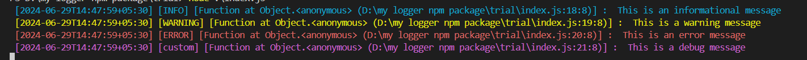

**README.md**

# colored-beautiful-logger

This colored-beautiful-logger library provides a flexible and customizable logger for your Node.js applications. It offers various log levels, colors, and formatting options to enhance the readability and debugging experience.

## Installation

To install the colored-beautiful-logger, run the following command in your project directory:

```bash
npm install colored-beautiful-logger
```

## Usage

To use the logger, import it into your file:

```typescript
import {Logger, LoggerOptions, Color} from 'colored-beautiful-logger';
const options: LoggerOptions = {
  logFolderPath: './logs',
  logFileName: 'app.log',
  logRotationInterval: 60000, // 1 minute
  saveLogFile: true,
  customLabels: [
    //always give label name in smallcase format
    { color: Color.MAGNENTA, label: 'custom' },
  ],
  printTimestamp: true,
  printCallerFunctionName: true,
  printCallerFunctionLocation: true,
};

const {logger} = new Logger(options);

logger.info('This is an informational message');
logger.warning('This is a warning message');
logger.error('This is an error message');
logger.custom('This is a custom message');
```

## Result



## API Documentation

The Colored Logger provides the following interfaces and methods:

### Interfaces

- `LoggerOptions`: Represents options for configuring the logger.
- `Color`: Represents different colors that can be used for log labels.

### Methods

- `new Logger(options: LoggerOptions)`: Creates a new instance of the logger with the specified options.
- `logger.error(message: string)`: Logs an error message.
- `logger.warning(message: string)`: Logs a warning message.
- `logger.info(message: string)`: Logs an informational message.
- `logger.success(message: string)`: Logs a success message.
- `logger.log(message: string)`: Logs a general message.
- `logger.notify(message: string)`: Logs a notification message.
- `logger.alert(message: string)`: Logs an alert message.
- `logger.critical(message: string)`: Logs a critical message.
- `logger.yourCustomLabelName(message: string)`: Logs a message with a custom label.

## Contributing

Contributions are welcome! If you find any bugs or have suggestions for improvements, please open an issue or submit a pull request on the [GitHub repository](https://github.com/surajkushvaha/colored-beautiful-logger#readme).

## License

This project is licensed under the MIT License.[ See the [LICENSE](https://github.com/surajkushvaha/colored-beautiful-logger/blob/main/LICENSE) file for more information.]