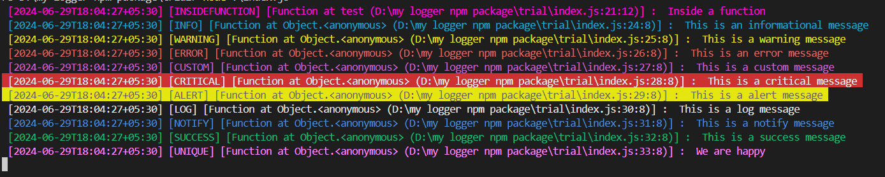

# Colored Beautiful Logger

The `colored-beautiful-logger` library provides a flexible and customizable logger for your Node.js applications. It offers various log levels, colors, and formatting options to enhance readability and debugging experience.

## Installation

To install the `colored-beautiful-logger`, run the following command in your project directory:

```bash
npm install colored-beautiful-logger
```

## Usage/Examples

To use the logger, import `Logger` into your project. You can use default colors, RGB colors, or ANSI colors in custom labels.

For ANSI color references, see [here](https://talyian.github.io/ansicolors/).

```typescript
import { Logger, LoggerOptions } from 'colored-beautiful-logger';

const options: LoggerOptions = {
  logFolderPath: './logs',
  logFileName: 'app.log',
  logRotationInterval: 60000, // 1 minute
  saveLogFile: true,
  customLabels: [
    // Take ANSI color reference from https://talyian.github.io/ansicolors/
    // Available color list:
    // ["BLACK", "RED", "GREEN", "YELLOW", "BLUE", "CYAN", "WHITE", "BLACKBG", "REDBG", "GREENBG", 
    // "YELLOWBG", "BLUEBG", "MAGENTABG", "CYANBG", "WHITEBG", "RESET", RGBColor, AnsiColor]
    { label: 'custom', color: { ansiCode: '\x1b[38;5;9m' } },
    { label: 'unique', color: 'RED' },
    { label: 'insideFunction', color: { R: 255, G: 204, B: 229, isBackground: true } }
  ],
  printTimestamp: true,
  printLabelName: true,
  printCallerFunctionLocation: true,
};

const { logger } = new Logger(options);

let test = () => {
  logger.insideFunction('Inside a function');
};
test();
logger.info('This is an informational message');
logger.warning('This is a warning message');
logger.error('This is an error message');
logger.custom('This is a custom message');
logger.critical('This is a critical message');
logger.alert('This is an alert message');
logger.log('This is a log message');
logger.notify('This is a notify message');
logger.success('This is a success message');
logger.unique('We are happy');
```

### Result



## API Reference

The `colored-beautiful-logger` provides the following interfaces and methods:

### Logger Methods

- `logger.error(message: any)`: Logs an error message.
- `logger.warning(message: any)`: Logs a warning message.
- `logger.info(message: any)`: Logs an informational message.
- `logger.success(message: any)`: Logs a success message.
- `logger.log(message: any)`: Logs a general message.
- `logger.notify(message: any)`: Logs a notification message.
- `logger.alert(message: any)`: Logs an alert message.
- `logger.critical(message: any)`: Logs a critical message.
- `logger.yourCustomLabelName(message: any)`: Logs a message with a custom label.

### new Logger (options: [LoggerOptions](#LoggerOptions))

A base class to initialize the Logger.

```typescript
const { logger } = new Logger(options);
```

#### Parameters

| Name            | Type                           | Argument     | Description                                  |
| :-------------- | :----------------------------- | :----------- | :------------------------------------------- |
| `LoggerOptions` | [LoggerOptions](#LoggerOptions) | `<optional>` | Set your options as you want to see logs     |

### LoggerOptions

Interface representing options for configuring the logger.

Type:
- object

Example:

```typescript
const options: LoggerOptions = {
  logFolderPath: './logs',
  logFileName: 'app.log',
  logRotationInterval: 60000, // 1 minute
  saveLogFile: true,
  customLabels: [
    { label: 'custom', color: { ansiCode: '\x1b[38;5;9m' } },
    { label: 'unique', color: 'RED' },
    { label: 'insideFunction', color: { R: 255, G: 204, B: 229, isBackground: true } }
  ],
  printTimestamp: true,
  printLabelName: true,
  printCallerFunctionLocation: true,
};
```

Properties:

| Name                        | Type                 | Argument     | Default                | Description                                                   |
| :-------------------------- | :------------------- | :----------- | :--------------------- | :------------------------------------------------------------ |
| `logFolderPath`             | `string`             | `<optional>` |                        | The path to the folder where logs will be saved.              |
| `logFileName`               | `string`             | `<optional>` |                        | The name of the log file.                                     |
| `logRotationInterval`       | `number`             | `<optional>` | `24 * 60 * 60 * 1000`  | The interval for log rotation, in milliseconds.               |
| `saveLogFile`               | `boolean`            | `<optional>` | `false`                | Whether to save the log file.                                 |
| `customLabels`              | [customLabels[]](#customLabels) | `<optional>` |                        | Custom labels to use in logging.                              |
| `printTimestamp`            | `boolean`            | `<optional>` | `false`                | Whether to print a timestamp in each log entry.               |
| `printLabelName`            | `boolean`            | `<optional>` | `false`                | Whether to print the label name in each log entry.            |
| `printCallerFunctionLocation` | `boolean`            | `<optional>` | `false`                | Whether to print the caller function location in each log entry. |

### customLabels

Interface representing custom labels with associated colors.

Type:
- object

Example:

```typescript
customLabels: [
  { label: 'custom', color: { ansiCode: '\x1b[38;5;9m' } },
  { label: 'unique', color: 'RED' },
  { label: 'insideFunction', color: { R: 255, G: 204, B: 229, isBackground: true } }
];
```

Properties:

| Name    | Type                     | Argument     | Description                          |
| :------ | :----------------------- | :----------- | :----------------------------------- |
| `color` | [COLOR](#COLOR) | `<optional>` | The color associated with the label. |
| `label` | `string`                 | `optional`   | The custom label text.               |

### COLOR

Values:

| Name       | Type    | Value     | Description                |
| :--------- | :------ | :-------- | :------------------------- |
| `BLACK`    | `string`| `\x1b[30m`| Black Color                |
| `RED`      | `string`| `\x1b[31m`| RED Color                  |
| `GREEN`    | `string`| `\x1b[32m`| GREEN Color                |
| `YELLOW`   | `string`| `\x1b[33m`| YELLOW Color               |
| `BLUE`     | `string`| `\x1b[34m`| BLUE Color                 |
| `MAGENTA`  | `string`| `\x1b[35m`| MAGENTA Color              |
| `CYAN`     | `string`| `\x1b[36m`| CYAN Color                 |
| `WHITE`    | `string`| `\x1b[37m`| White Color                |
| `BLACKBG`  | `string`| `\x1b[40m`| Background Black Color     |
| `REDBG`    | `string`| `\x1b[41m`| Background Red Color       |
| `GREENBG`  | `string`| `\x1b[42m`| Background Green Color     |
| `YELLOWBG` | `string`| `\x1b[43m`| Background Yellow Color    |
| `BLUEBG`   | `string`| `\x1b[44m`| Background Blue Color      |
| `MAGENTABG`| `string`| `\x1b[45m`| Background Magenta Color   |
| `CYANBG`   | `string`| `\x1b[46m`| Background Cyan Color      |
| `WHITEBG`  | `string`| `\x1b[47m`| Background White Color     |
| `RESET`    | `string`| `\x1b[0m` | Background Reset Color     |
| `AnsiColor`| `object`|            | Color in ANSI Code         |
|            |         |            | `{ ansiCode: string }`     |
| `RGBColor` | `object`|            | RGB Color values           |
|            |         |            | `{ R: number, G: number, B: number, isBackground <optional>: boolean }` |

## Notes

- If you get an error message in the browser console stating that `Property 'yourlabelname' comes from an index signature, so it must be accessed with ['yourlabelname']`, then add this line in your `tsconfig.json` file: `"noPropertyAccessFromIndexSignature": false`.
- Log file save option is not supported in the browser environment.
- The color of terminal console output and browser console output can be different.

## Changelog

See Changelog [here](changelog.md) for more information.

## Color Reference

For ANSI color reference, see [here](https://talyian.github.io/ansicolors/).

## Authors

- [@surajkushvaha](https://www.github.com/surajkushvaha)

## Contributing

Contributions are always welcome!

If you find any bugs or have suggestions for improvements, please open an issue or submit a pull request on the [GitHub repository](https://github.com/surajkushvaha/colored-beautiful-logger/issues).

## License

This project is licensed under the MIT License. See the [LICENSE](https://github.com/surajkushvaha/colored-beautiful-logger/blob/main/LICENSE) file for more information.
